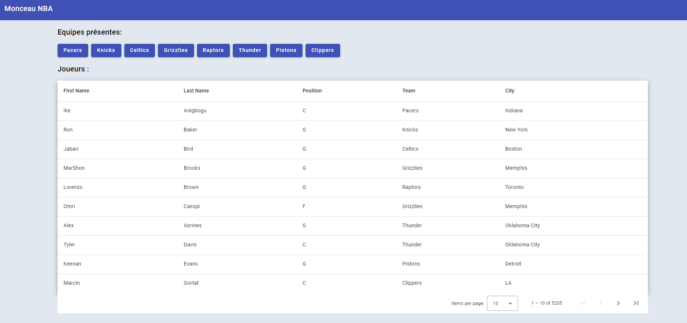
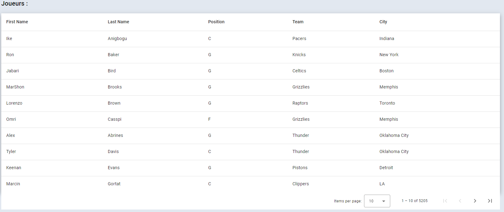
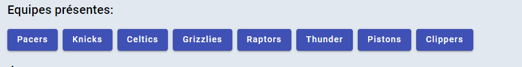
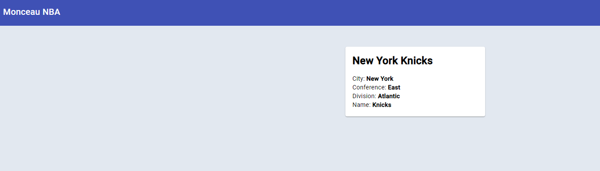

# Monceau NBA

## Avant-Propos

Ce Repository est un exercice d'entretien mis au point pour les candidats à un poste de développeur Angular au sein du SI de Monceau Assurances.

La durée de résolution de cet exercice est estimée à plus ou moins 2 heures.

Seules vos compétences sur le framework Angular seront mises en avant.
Aucun code CSS et aucun code HTML n'est demandé pour cet exercice.

Vous pouvez faire appel à des bibliothèques externes pour réaliser l'exercice mais ce n'est pas obligatoire.

vous pouvez créer de nouveaux fichier pour résoudre l'excercice.

La version actuelle d'Angular pour cet exercice est la version 16.2.

L'API utilisé dans le repository est une API de NBA (basket) nommée
[balldontlie](https://www.balldontlie.io/home.html).

## Organisation du Repository

Le repository contient les fichiers suivants:

- src/app/data_access/nba-api.service.ts : qui contient les appels API nécessaires à la réalisation de l'exercice.

- src/app/models/nba-api.model.ts : qui contient les interfaces décrivant les données de l'API.
- src/app/players-table.component.ts : le fichier à modifier pour la première partie de l'exercice.

- src/app/team-info.component.ts : le fichier à modifier pour la seconde partie de l'exercice.

## But

Le but de cet exercice est de faire fonctionnement une table avec pagination, alimentée via l'API de basket.
Il vous sera aussi demandé d'alimenter les informations d'une page
en fonction de ses paramètres d'URL.

Les solutions élégantes sont encouragées.

## Exercice 1

L'exercice 1 consiste en plusieurs étapes:

- Alimenter une table en données via l'API mise à disposition.
- Gérer un système de pagination pour cette table.
- afficher un ensemble de liens au dessus-de la table (matérialisés par les boutons bleus) en fonction des
  données de la table.

Voici ci-dessus une photo du résultat attendu.

### table

Les lignes de la table doivent contenir les informations des joueurs de basket. La table doit avoir un système de pagination qui permet de changer de page ainsi que de changer le nombre de lignes par page.

### liens

Les liens au dessus de la table doivent indiquer les noms des équipes ayant au moins un joueur figurant dans la page affichée.
Cliquer sur un des liens doit au terme du second exercice, permettre de naviguer sur la page d'informations de l'équipe correspondante.

## Exercice 2

L'exercice 2 consiste à alimenter le composant _src/app/team-info.component.ts_ avec les données de l'équipe correspondant au paramètre d'URL _teamId_.

Bonne chance !
